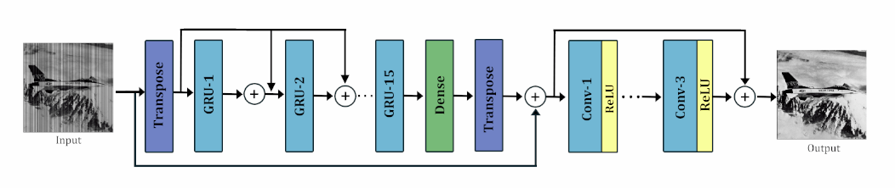
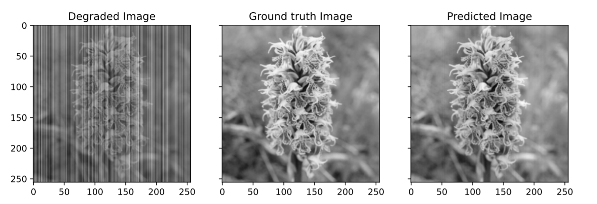

## DEEP UNFOLDING FOR ITERATIVE STRIPE NOISE REMOVAL

#### Zeshan Fayyaz, Daniel Platnick, Hannan Fayyaz, Nariman Farsad 

> The non-uniform photoelectric response of infrared imaging results in fixed-pattern stripe noise being superimposed on infrared images, which severely reduces image quality. Existing destriping methods struggle to concurrently remove all stripe noise artifacts, preserve image details and structures, and balance real-time performance. In this paper, we propose an innovative destriping method which takes advantage of spatial feature estimation. Our model iteratively uses neighbouring column signal correlation to remove independent column stripe noise. The proposed method allows for a more precise estimation of stripe noise to preserve scene details more accurately. Extensive experimental results demonstrate that the proposed model outperforms existing destriping methods on artificially corrupted images on both quantitative and qualitative assessments. 



### INSTALLATION

```
Python 3.8.10
Tensorflow 2.5.0
Keras 2.4.3 
```

### DIRECTORY ORGANIZATION 

1. Please download the Linnaeus 5 and BSDS images from ```./Datasets/Train/BSDS500/``` and ```./Datasets/Train/dataset```. Combine all training images and place into 'CombinedTrain' directory. 

2. Please download the testing folders found in ./Datasets/Test/ 

Folder architecture should be as follows: 
```
./Datasets/
./Datasets/Train/
./Datasets/Train/CombinedTrain/
./Datasets/Test/
./Datasets/Test/BSDS100/
./Datasets/Test/INFRARED100/
./Datasets/Test/Linnaeus5/
./Datasets/Test/Set12/
./Datasets/Test/Urban100/
```

### EVALUATE MODEL ON PRETRAINED WEIGHTS

Download our pretrained model found from ```./pretrained_model/destriping```

Download ```evaluate.py```

Edit ```Line 37``` to reflect the directory which contains ```model_checkpoint.h5```

Edit ```Line 23, 26, 29, 32, and 35``` to reflect the directories which contains the 5 test datasets ```[BSDS100, INFRARED100, Set12, Linnaeus5, Urban100]```

Uncomment the ```TESTDIR``` you wish to evaluate on. Script returns degraded and predicted PSNR and SSIM values. 


### TRAIN MODEL

Download ```main.py```

Create two directories. ```./15GRU3CNN/trained_model_weights/``` and ```./15GRU3CNN/Results/``` 

Edit ```Line 22 and 23``` to reflect training dataset and test dataset. 

Edit ```Line 24``` to the directory ```[./15GRU3CNN/Results/]``` where we wish to save: 10 pdf images containing degraded and predicted testing images, 10 corresponding .txt files containing PSNR and SSIM metrics, TrainingLoss.pdf, TrainingValidationLoss.pdf, and ValidationLoss.pdf 

Edit ```Line 239 and 289``` to ```./15GRU3CNN/trained_model_weights/``` where we save ```model_checkpoint.h5``` and ```stripe_noise_model.h5``` 

An example of a saved .pdf image containing predicted images is as follows: 




